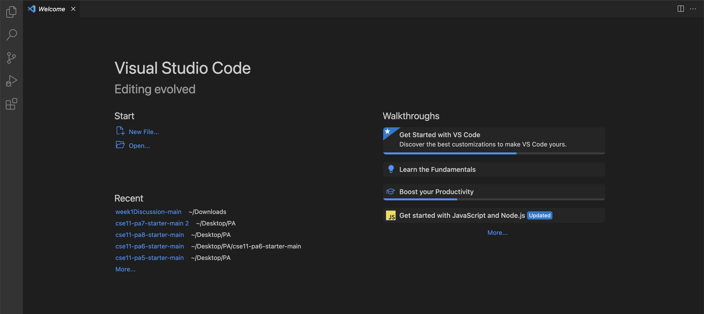
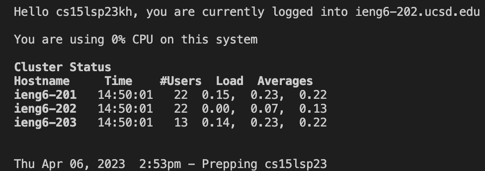

# **Step 1: Visual Studio Code**
To download Visual Studio Code, go to this [Link](https://code.visualstudio.com/) and follow the instructions to download and install it on your computer. Choose the version that matches your operating system. When installed, the window will look something like this. 


# **Step 2: Remotely Connecting**
Go to this [Link](https://sdacs.ucsd.edu/~icc/index.php) to reset the password of your account. 
Then go to your Visual Studio Code window and create a new terminal.
Type in `ssh cs15lsp23kh@ieng6.ucsd.edu` in the terminal. 
If you see something like this:
```
ssh cs15lwi23zz@ieng6.ucsd.edu
The authenticity of host 'ieng6.ucsd.edu (128.54.70.227)' can't be established.
RSA key fingerprint is SHA256:ksruYwhnYH+sySHnHAtLUHngrPEyZTDl/1x99wUQcec.
Are you sure you want to continue connecting (yes/no/[fingerprint])? 
```
Type `yes` then give your password.
After you type in your password, you will get a message like this: 


# **Step 3: Run Some Commands**

