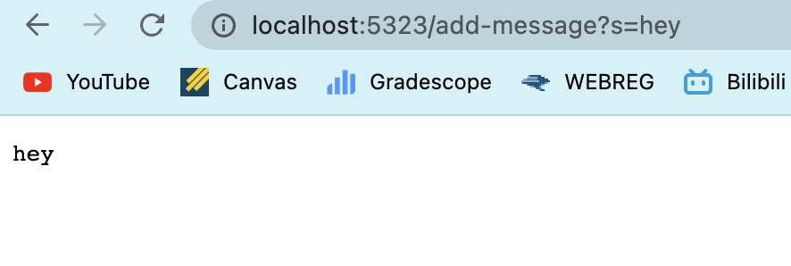
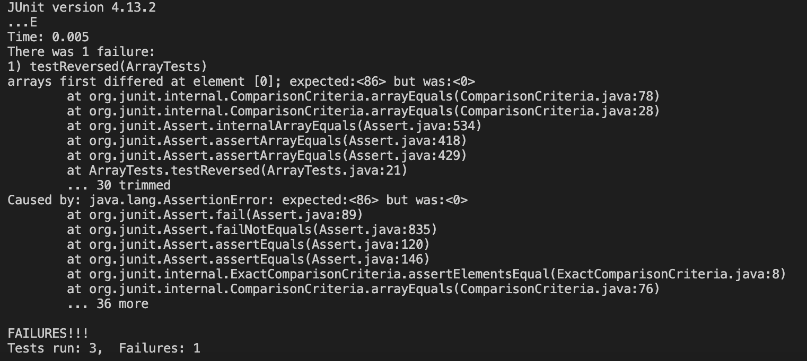

# Lab Report 2 - Servers and Bugs
## Part 1
**StringServer code**
```
import java.io.IOException;
import java.net.URI;

class Handler implements URLHandler{
    String result = "";
    // /add-message?s=<string>
    public String handleRequest(URI url){
        if (url.getPath().equals("/")){
            return result; 
        }
        else if (url.getPath().contains("/add-message")){
            String[] parameters = url.getQuery().split("=");
            if (parameters[0].equals("s")){
                result += parameters[1] + "\n";
                return result; 
            }
            return "404 Not Found!";
        }
        else{
            return "404 Not Found!";
        }
    }
}
public class StringServer {
    public static void main(String[] args) throws IOException{
        if (args.length == 0){
            System.out.println("Missing port number!");
            return;
        }
        int port = Integer.parseInt(args[0]);
        Server.start(port, new Handler());
    }  
}
```


The handleRequest method is called because a port is created and once you change the path and query, it prints out the message in the url query.
The argument is the url of type URI after the port number. First you get the path and if it equals to `/add-message` then you split the query by the equal sign and if the first index of the query array is `s`, then print out the second index of the query array. In this case, the url is `/add-message?s=hi` so the method identified the path which is `/add-message` and splits the query into `s` and `hi`. In this case, `s` equals to `s` so the method returns `hi`. 
The result changes by changing the query, specifically the part after the equal sign. It returns a new request based on the code: `result += parameters[1] + "\n";` which would be `result += "hi" + "\n"`.


The handleRequest method is called.
The relevent arguements to this method are path and query. The values for path is `/add-message` and the query is  `s=hello`. The method splits the query string by the equal sign and creates an array of `"s", "hello"`. If the first index of this array equals to `s`, it prints out the second index of this array which is `hello`. 
The result changes by changing the query, specifically the part after the equal sign. It returns a new request based on the code: `result += parameters[1] + "\n";` which would be `result += hello + "\n"`

## Part 2
**Reversed method**

Failure-inducing input:
```
int[] input2 = {0, 2, 10, 44, 86};
assertArrayEquals(new int[]{86, 44, 10, 2, 0}, ArrayExamples.reversed(input2));   
```
Input that doesn't induce failure:
```
int[] input1 = {  };
ArrayExamples.reversed(input1);
```
The symptom: 


The Bug (before):
```
  static int[] reversed(int[] arr) {
    int[] newArray = new int[arr.length];
    for(int i = 0; i < arr.length; i += 1) {
      arr[i] = newArray[arr.length - i - 1];
    }
    return arr;
  }
```

After: 
```
  static int[] reversed(int[] arr) {
    int[] newArray = new int[arr.length];
    for(int i = 0; i < arr.length; i += 1) {
      newArray[i] = arr[arr.length-i-1];
    }
    return newArray;
  }
```
The original code did not return a new array and it is more of reversing an empty newArray with null elements and copy it onto the arr, in other words, replacing the original elements in arr with the reversed newArray.
The fix is reversing the arr by changing the elements in the newArray, so the first index of newArray is the last element of arr, the second index of newArray is the second to the last element of arr. Lastly, return a newArray rather than the original arr.

## Part 3
I didn't know how changing the url path and queries changes the content in the url. I also didn't know that how to debug my code by creating a failure-inducing input. 

