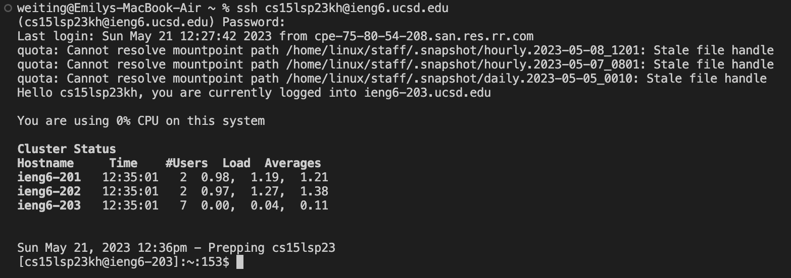
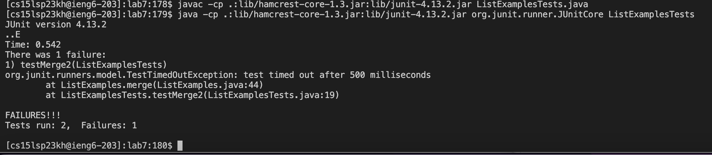
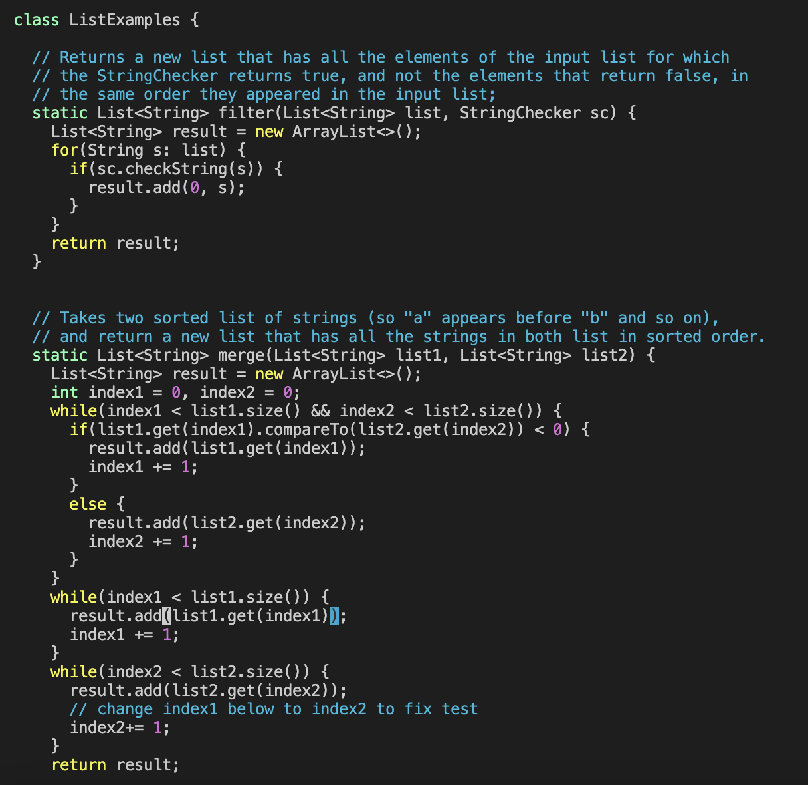
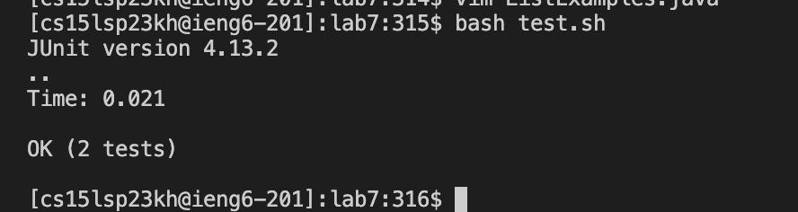
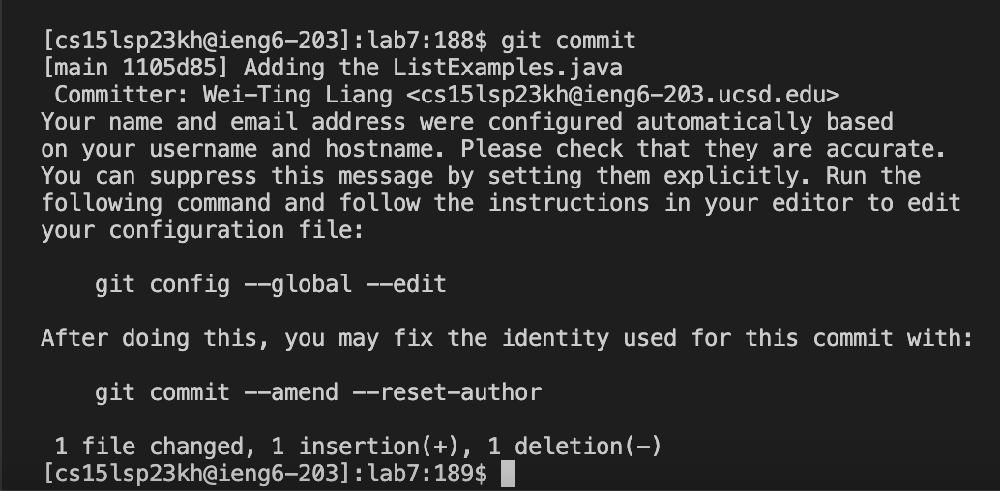
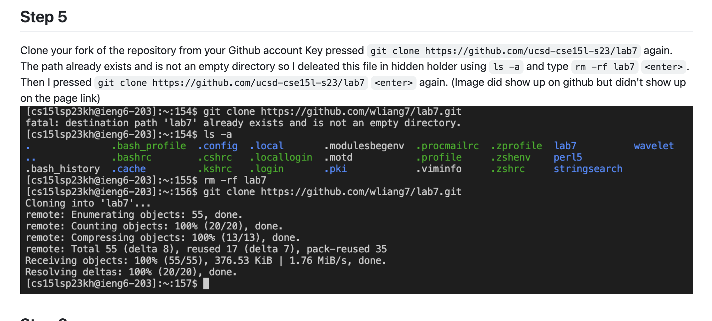

# Lab Report 4 

## Step 4
Log into ieng6
Key pressed: `ssh cs15lsp23kh@ieng6.ucsd.edu`, then type in the password of my account. I couldn't use ssh keys because i'm off campus.  

## Step 5
Clone your fork of the repository from your Github account
Key pressed `git clone https://github.com/ucsd-cse15l-s23/lab7` <enter> again. 
The path already exists and is not an empty directory so I deleated this file in hidden holder using `ls -a` <enter> and type `rm -rf lab7` `<enter>`.
Then I pressed `git clone https://github.com/ucsd-cse15l-s23/lab7` `<enter>`  again. 
 (Image did show up on github but didn't show up on the page link, proof in the end)

 
## Step 6
Run the tests, demonstrating that they fail
Key pressed `bash test.sh`

## Step 7
Edit the code file `ListExamples.java` to fix the failing test (as a reminder, the error in the code is just that `index1` is used instead of `index2` in the final loop in `merge`)
Key pressed `vim ListExamples.java` `<enter>`. Then press `</><index1><enter><n><n><n><n><n><n><n><n><n><l><l><l><l><l><x><i><2>`.
  `</><index1>` is to search index1 in the file. `<n>` is to get the next index1. `<l>` is to go to the right. `<x>` is to delete. `<i>` is to insert. `<2>` is to change to index2. 
Then `<esc><:><w><q>` to leave editing mode and save and quit vim mode. 
  `<esc>` is to escape the insert mode. `<:><w><q>` is to save and quit. 

## Step 8
Run the tests, demonstrating that they now succeed
Key pressed `bash test.sh`

 
  
## Step 9
Commit and push the resulting change to your Github account
Key pressed: 
  `git status` 
  `git add ListExamples.java` 
  `git commit` 
  `Adding the ListExamples.java` `<esc><:><w><q>` (escape insert mode save and quit)

 
 
 
