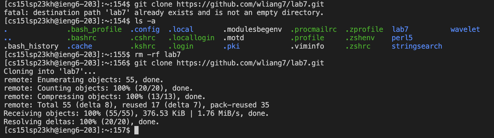
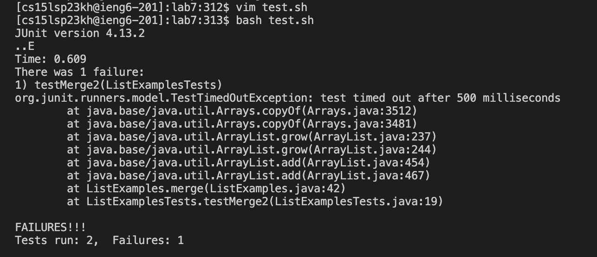
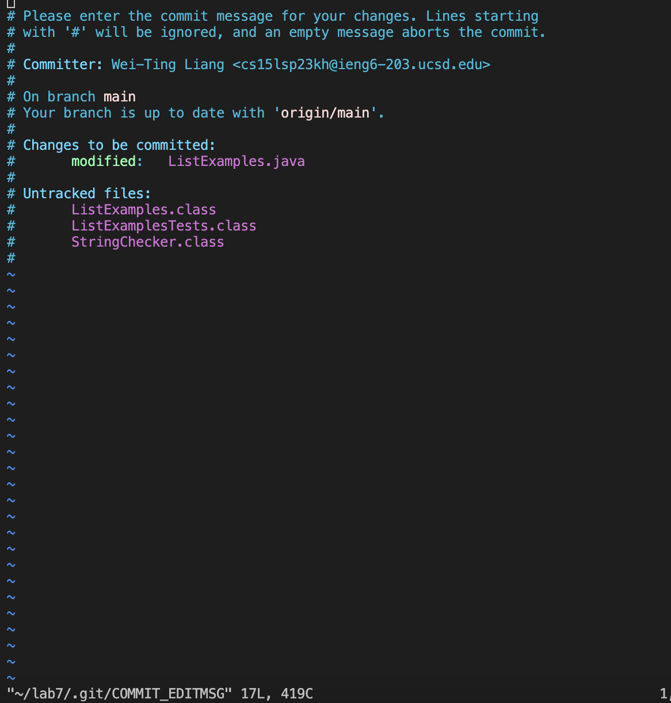

# Lab Report 4 

## Step 4
Log into ieng6
Key pressed: `ssh cs15lsp23kh@ieng6.ucsd.edu`, then type in the password of my account. 

## Step 5
Clone your fork of the repository from your Github account
Key pressed `git clone https://github.com/ucsd-cse15l-s23/lab7` <enter> again. 
The path already exists and is not an empty directory so I deleated this file in hidden holder using `ls -a` <enter> and type `rm -rf lab7` `<enter>`.
Then I pressed `git clone https://github.com/ucsd-cse15l-s23/lab7` `<enter>`  again. 

## Step 6
Run the tests, demonstrating that they fail
Key pressed `javac -cp .:lib/hamcrest-core-1.3.jar:lib/junit-4.13.2.jar ListExamplesTests.java` `<enter>` to compile.
To execute: `java -cp .:lib/hamcrest-core-1.3.jar:lib/junit-4.13.2.jar org.junit.runner.JUnitCore ListExamplesTests` `<enter>`

## Step 7
Edit the code file `ListExamples.java` to fix the failing test (as a reminder, the error in the code is just that `index1` is used instead of `index2` in the final loop in `merge`)
Key pressed `vim ListExamples.java` `<enter>`. Then press `</><index1><enter><n><n><n><n><n><n><n><n><n><l><l><l><l><l><x><i><2>`.
Then `<esc><:><w><q>` to leave editing mode and save and quit vim mode. 

## Step 8
Run the tests, demonstrating that they now succeed
Key pressed `javac -cp .:lib/hamcrest-core-1.3.jar:lib/junit-4.13.2.jar ListExamplesTests.java` `<enter>` to compile.
To execute: `java -cp .:lib/hamcrest-core-1.3.jar:lib/junit-4.13.2.jar org.junit.runner.JUnitCore ListExamplesTests` `<enter>`

  
## Step 9
Commit and push the resulting change to your Github account
Key pressed: `git status` `git add ListExamples.java` `git commit` `Adding the ListExamples.java` `<esc><:><w><q>`

