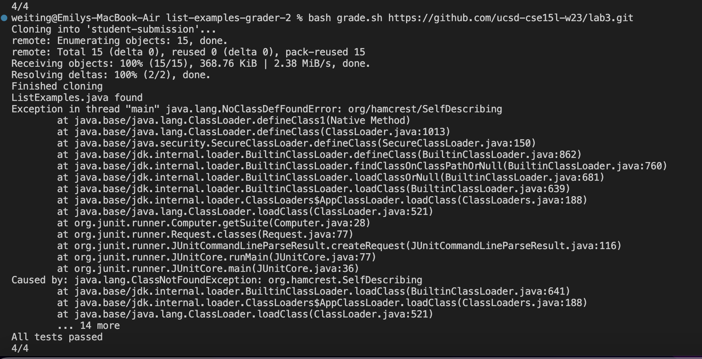
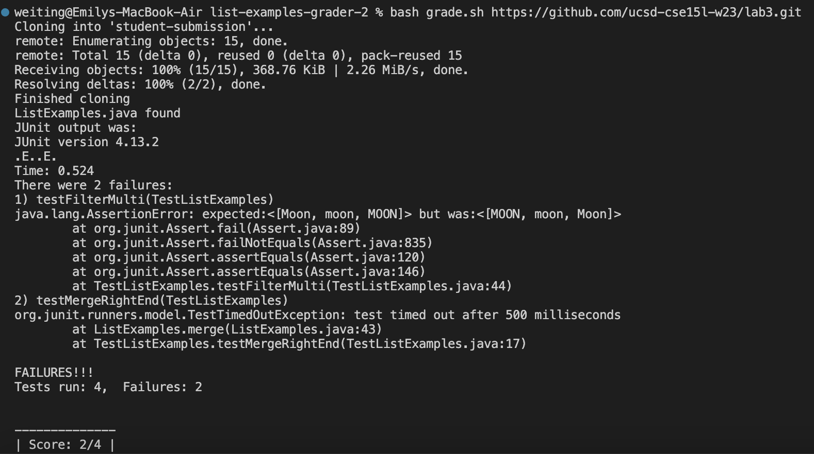

# Lab Report 5
1. The original post from a student with a screenshot showing a symptom and a description of a guess at the bug/some sense of what the failure-inducing input it.
* What environment are you using (computer, operating system, web browser, terminal/editor, and so on)?
    Using macbook, terminal on VS code
* Detail the symptom.
     There is a NoClassDefFoundError: org/hamcrest/SelfDescribing error. There is an error when either compiling the files or executing the file. The tester and bash script is expected to run successfully and produce a failure output. 
    
* Detail the failure-inducing input and context. 
    failure-inducing input is: 
       `bash grade.sh https://github.com/ucsd-cse15l-w23/lab3.git`
    Problem in the bash script: (fails to produce a failure which is the expected output)
```
cp student-submission/ListExamples.java ./

javac -cp $CPATH *.java

java -cp $CPATH org.junit.runner.JUnitCore TestListExamples > junit-output.txt
```
$CPATH:
  `CPATH='.:lib/hamcrest-core-1.3.jar:lib/junit-4.13.2.jar'`

2. A response from a TA asking a leading question or suggeting a command to try.
* I would suggest to check whether CPATH is correct. 
3. Another screenshot/terminal output showing what information the student got from trying that, and a clear description of what the bug is.
    The CPATH misses a directory lib so the original code failed to find the correct path of the junit file. 
    
4. At the end, all the information needed about the setup including:
* The file & directory structure needed
    `ListExamples.java` and `lib/hamcrest-core-1.3.jar:lib/junit-4.13.2.jar` and `TestListExamples.java`
* The contents of each file before fixing the bug
    `ListExamples.java`: the content of this file is the compiler to run the `TestListExamples.java` file. 
    `lib/hamcrest-core-1.3.jar` is the file to help run the files and run the testers.
    `lib/junit-4.13.2.jar` is the file to help run the files and run the testers.
    `TestListExamples.java` is the file that the junit test executes on to make sure `ListExamples.java` works. 
* The full command line (or lines) you ran to trigger the bug
    `bash grade.sh https://github.com/ucsd-cse15l-w23/lab3.git`
* A description of what to edit to fix the bug 
    Edit the CPATH and add a lib directory before hamcrest-core-1.3.jar because there is a directory before those files. We cannot jump from the current folder to the files. 
