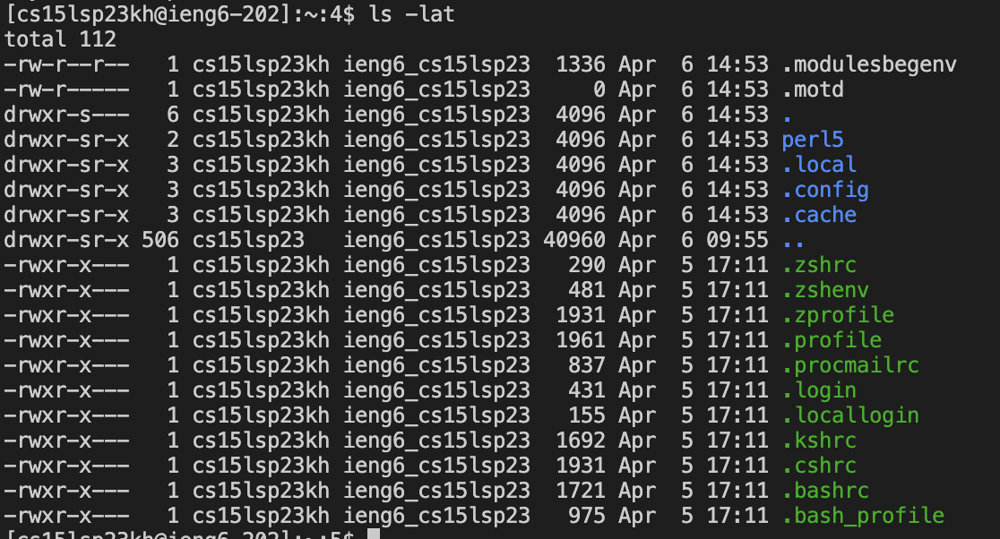

I downloaded vscode since last quarter so it was already there.

I changed my password and connect my account to a server. I typed in ssh cs15lsp23kh@ieng6.ucsd.edu.

I tried typing in ls -lat. I made some mistakes by adding ~ or without space but I eventually got the result. 
